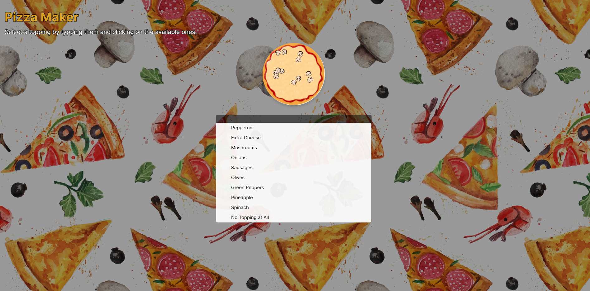

# Pizza Maker 🍕



## Overview 🔄

The **Pizza Maker** was born in a cool workshop I did with my colleagues. It is an interactive web application built with Vue 3 for creating a custom pizza by adding various ingredients through a user-friendly autocomplete dropdown. Each ingredient is dynamically placed on the pizza base with randomized positions and animations, creating a visually appealing experience.

### Features 🎉

- Add multiple ingredients to a pizza with random positions and rotations.
- Remove ingredients of the same type when the maximum limit is reached.
- Real-time search and autocomplete for selecting ingredients.
- Smooth animations for ingredient addition and removal.
- Clear and responsive UI built with SCSS for styling.

## Tech Stack ⚡

- **Vue 3**: Reactive UI framework.
- **Pug**: For template syntax.
- **SCSS**: For modular and reusable styling.
- **HTML/CSS**: For base structure and styling.

## Setup Instructions 🛠️

### Prerequisites 📦

Ensure you have the following installed:

- [Node.js](https://nodejs.org/) (v16 or higher)
- [npm](https://www.npmjs.com/) or [yarn](https://yarnpkg.com/)

### Installation 💻

1. Clone the repository:

   ```bash
   git clone https://github.com/Abel04/pizza-maker.git
   cd pizza-maker
   ```

2. Install dependencies:

   ```bash
   npm install
   # or
   yarn install
   ```

3. Start the development server:

   ```bash
   npm run dev
   # or
   yarn dev
   ```

4. Open your browser and navigate to:
   ```
   http://localhost:3000
   ```

## Project Structure 🔮

```
project-root/
├── public/                # Static assets
├── src/                   # Source files
│   ├── assets/         # Images and media
│   ├── components/     # Vue components
│   └── main.js        # Entry point
└── package.json         # Dependency management
```

## Usage 🚀

1. Type the name of an ingredient (e.g., `Pepperoni`) in the autocomplete input box.
2. Select an ingredient from the dropdown menu to add it to the pizza.
3. Observe the ingredient animations as they appear on the pizza base.
4. Use the clear button to reset the typed text.

### Supported Ingredients 🍲

- Pepperoni
- Extra Cheese
- Mushrooms
- Onions
- Sausages
- Olives
- Green Peppers
- Pineapple
- Spinach
- No Topping at All (clears all ingredients)

## Deployment ⚙️

1. Build the project for production:

   ```bash
   npm run build
   # or
   yarn build
   ```

2. Serve the files in the `dist/` directory using a static file server or deploy them to a hosting platform.

## License 📝

This project is licensed under the MIT License - see the [LICENSE](LICENSE) file for details.
